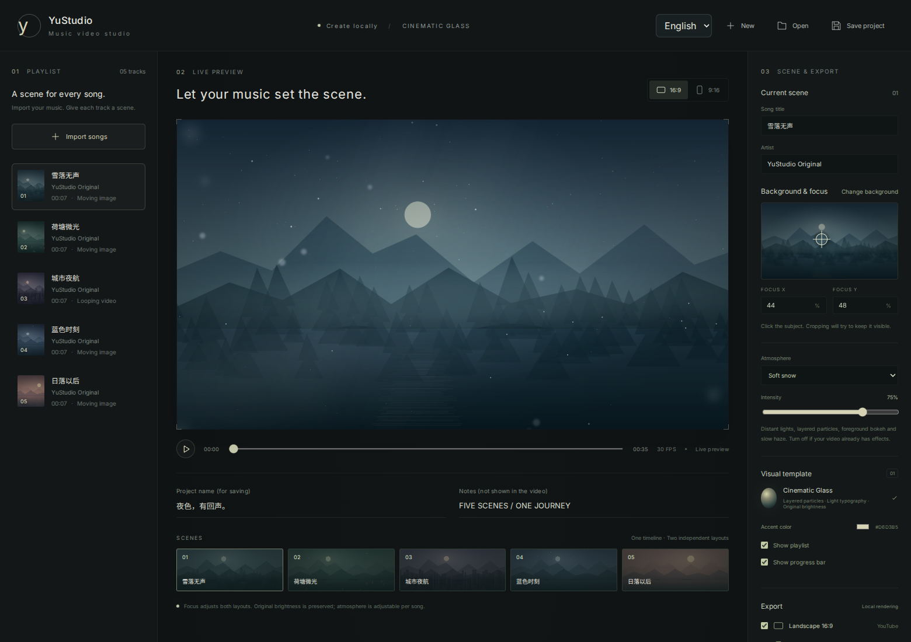

# YuStudio

[中文](README.md) · **English** · [Website](https://hongyuleo.github.io/YuStudio/) · [Download](https://github.com/HongyuLeo/YuStudio/releases/latest)

A local music playlist video studio. Give every song its own image or animated background, with light typography, layered particles and smooth transitions. Export landscape and portrait videos from one timeline.



## Get started on Windows

1. Download **YuStudio-Windows-x64.zip** from [Releases](https://github.com/HongyuLeo/YuStudio/releases/latest).
2. Extract the entire archive and open **YuStudio.exe**. Keep the accompanying files beside it.
3. Choose **中文 / English** in the upper-right corner. Editor labels, performance settings, export progress and file dialogs switch languages. Your preference is remembered.
4. Select **New → Import songs**. For each track, choose **Change background** and click its subject to set the crop focus.
5. Adjust embers, snow, fireflies, playlist and progress display. Choose export settings and select **Create music video**.

The Windows x64 package includes Electron, fonts, FFmpeg and platform rendering binaries; Node.js is not required. The first export downloads Chromium. Subsequent local media processing can work offline. The package has no commercial code-signing certificate.

## Features

- Chinese and English in one app; changing UI language leaves song titles, artist names and project content intact.
- Camera motion for images, looping video backgrounds, independent scenes and focus per track.
- Cinematic Glass preserves background brightness with unobtrusive text, layered particles, foreground bokeh and haze.
- Landscape 1920×1080 / 2560×1440 / 3840×2160; portrait 1080×1920 with its own layout.
- 30 / 60 FPS; H.264 / H.265; AAC 48 kHz; automatic YouTube chapter timestamps.
- NVIDIA NVENC, automatic GPU/CPU selection or CPU-only encoding.
- Manual concurrency up to the system’s logical thread count, measured concurrency selection and lossless background frame caching.
- Project files, local autosave, live preview, cancellation and downloadable diagnostics.
- No software branding or watermark in exports. Blank artists are hidden.

## Upgrade from Nocturne Studio

Close the old app, extract YuStudio into a new folder and open it. When YuStudio has no existing media library, it checks for the previous `nocturne-music-video-studio` profile and reuses that directory. Keep the old profile in place. You can also select **Open** to load an existing project JSON. The project format and relative media paths are unchanged.

## Performance

**Full power** requires NVENC, chooses ANGLE and lossless backgrounds, and enables **Measure fastest concurrency**. It tests the current resolution, FPS, bitrate and effects separately for each orientation. Candidates include 4 / 8 / 16 / 32, the system maximum and your value, within the system limit. Selection uses completed output throughput of short samples.

Measurement adds preparation time, especially for short clips. For repeated exports, disable measurement and enter a previously measured value. Higher concurrency is not always faster. Overall CPU/GPU utilization does not measure the complete rendering pipeline. NVENC handles encoding while Chromium generates frames. Required NVENC stops and reports initialization failures instead of falling back silently.

Lossless backgrounds use extra disk space on their first preparation and are reused later. The MB setting is the video reader’s memory budget; disk frame cache is measured separately. Caching and concurrency do not automatically lower quality. **Encoding presets can change compression efficiency or quality**, particularly at a fixed bitrate.

## Develop from source

Use Node.js 22 LTS. Original demo media and atmosphere textures are included.

```bash
npm ci
npm test
npm run build
npm start
```

Open the printed `http://127.0.0.1:4317` address. Development: `npm run dev`; desktop window: `npm run desktop`.

Build on Windows with `npm run dist:win` or `Build-Windows.bat`; output is in `release/`. GitHub Actions runs tests, builds on Windows, opens the packaged desktop to check both languages and the local service, then publishes ZIP files and SHA-256 checksums.

## License

Project code: [MIT](LICENSE). Original demo audio and backgrounds: CC0. Fonts, Electron, FFmpeg and dependencies: [third-party notices](THIRD_PARTY_NOTICES.md). Rendering uses Remotion; check the applicable terms for commercial/team use: [Remotion License](https://www.remotion.dev/license). Use music and backgrounds for which you have the appropriate rights.

See [VALIDATION.md](VALIDATION.md) for verification scope and limitations.
