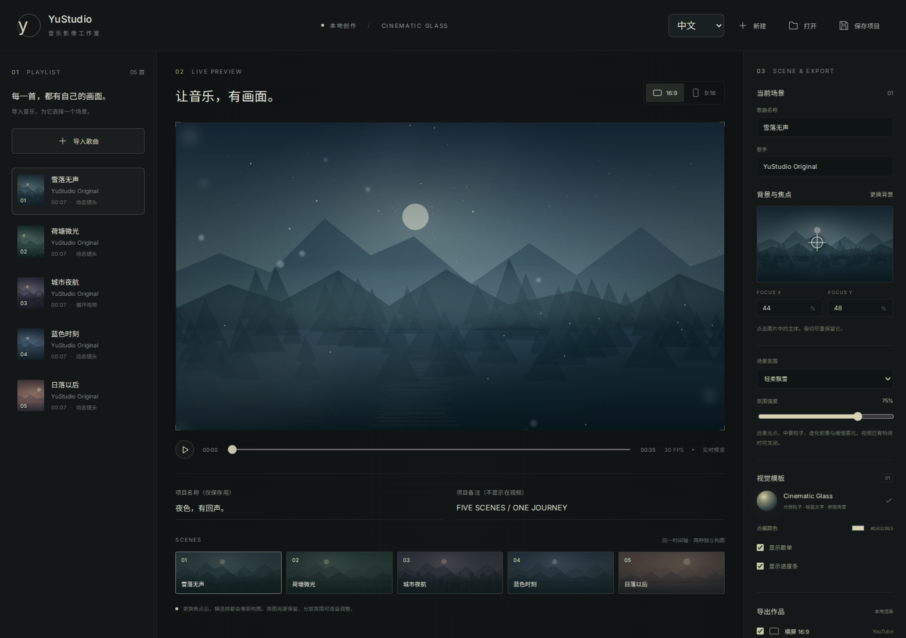

# YuStudio

**中文** · [English](README.en.md) · [介绍页 / Website](https://hongyuleo.github.io/YuStudio/) · [下载 / Download](https://github.com/HongyuLeo/YuStudio/releases/latest)

本地运行的音乐歌单视频制作工具。每首歌都可以拥有独立的图片或动态背景，配上轻盈文字、分层粒子和丝滑转场，同时输出横屏与竖屏视频。



## Windows 使用

1. 在 [Releases](https://github.com/HongyuLeo/YuStudio/releases/latest) 下载 **YuStudio-Windows-x64.zip**。
2. 完整解压到普通文件夹，双击 **YuStudio.exe**。保留同目录的配套文件。
3. 右上角选择 **中文 / English**。界面、性能设置、导出进度和文件对话框随之切换；软件会记住选择。
4. 点击 **新建 → 导入歌曲**，逐首选择 **更换背景**，点击背景主体设置裁切焦点。
5. 按需调整火星、飘雪、萤光、歌单和进度条，选择输出设置，点击 **生成音乐影像**。

Windows x64 桌面包包含 Electron、字体、FFmpeg 和平台渲染组件，无需安装 Node.js。首次导出会下载 Chromium，之后可离线处理本机素材。包未使用商业代码签名证书。

## 功能

- 一个软件内切换中文、英文，语言设置独立于作品内容。
- 图片镜头运动、短视频循环、每首歌独立场景与焦点定位。
- Cinematic Glass：保留背景亮度，靠边轻量文字，分层粒子、虚化前景和雾光。
- 横屏 1920×1080 / 2560×1440 / 3840×2160；竖屏 1080×1920，独立构图。
- 30 / 60 FPS；H.264 / H.265；AAC 48 kHz；YouTube 章节时间戳。
- NVIDIA NVENC、自动 GPU/CPU 选择或纯 CPU 编码。
- 本机逻辑线程范围内的手动并发、实测并发选择和无损背景帧缓存。
- 项目保存、自动记忆、实时预览、任务取消与可下载诊断报告。
- 成片不添加软件品牌或水印；歌手留空时直接隐藏歌手行。

## 从 Nocturne Studio 升级

关闭旧版，把 YuStudio 完整解压到新文件夹后运行。首次启动会检查旧版 `nocturne-music-video-studio` 用户目录；若 YuStudio 还没有自己的素材库，则继续使用原目录，素材无需搬动。保留旧数据目录，也可以用 **打开** 选择原来的项目 JSON。旧项目格式与相对素材路径不变。

## 性能设置

**全力输出** 选择强制 NVENC、ANGLE、无损背景缓存，并启用 **实测最快并发**。测速使用当前分辨率、帧率、码率和特效，分别测试横屏、竖屏；包含 4 / 8 / 16 / 32、本机最大值和填写值，按短样本完整输出吞吐选择。

测速会增加前期等待，尤其是短片。重复生成时可以关闭测速，填写已经测得的并发。更高并发不保证更快；CPU/GPU 总占用率也不能代表整个逐帧渲染流程的吞吐。NVENC 加速编码，画面仍由 Chromium 生成。强制 NVENC 初始化失败会停止并报告，不会偷偷换成 CPU。

无损背景缓存首次准备需要额外磁盘空间，后续复用；界面的 MB 数值是视频读取内存预算，磁盘帧缓存独立计量。缓存与并发不会自动降低画质；**编码档位可能改变压缩效率或质量**，固定码率时尤其如此。

## 从源码开发

需要 Node.js 22 LTS。仓库已经包含原创演示素材与氛围纹理。

```bash
npm ci
npm test
npm run build
npm start
```

打开终端显示的 `http://127.0.0.1:4317`。开发模式：`npm run dev`；桌面窗口：`npm run desktop`。

Windows 构建：`npm run dist:win` 或双击 `Build-Windows.bat`，输出在 `release/`。GitHub Actions 先运行测试，再在 Windows 构建、启动桌面检查双语和本地服务，然后发布 ZIP 与 SHA-256 校验值。

## 授权与使用范围

代码为 [MIT](LICENSE)。原创演示音频、背景为 CC0；字体、Electron、FFmpeg 与其他依赖见 [第三方声明](THIRD_PARTY_NOTICES.md)。渲染使用 Remotion，商用及团队使用请确认其适用许可：[Remotion License](https://www.remotion.dev/license)。请使用拥有相应权利的歌曲和背景。

验证范围与限制见 [VALIDATION.md](VALIDATION.md)。
